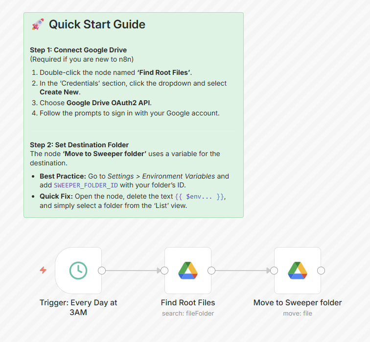

# 🧹 Google Drive Root Sweeper

An n8n workflow that automatically moves any loose files sitting in the **root of your Google Drive** into a designated "sweeper" folder — keeping your Drive root clean without any manual effort.

Runs silently every night at 3 AM.

## 🤔 The Problem

Google Drive has two behaviors that silently clutter your root over time:

1. **Quick-created files land in root by default.**  
   When you create a new Google Doc, Sheet, or Slides from [drive.google.com](https://drive.google.com) or from the `New` button, it saves directly to the root of My Drive. Unless you manually move it at creation time — which most people don't — it just stays there. Over weeks this turns your Drive root into an unorganized dump.

2. **Gemini AI exports go straight to root.**  
   When you export a Gemini response or generated document to Google Drive, it lands in the root with no option to choose a destination. There's currently no built-in setting to change this default behavior.

The result: your Drive root slowly fills up with orphaned files, and the only fix is tedious manual cleanup. This workflow handles that automatically.

## 📸 Preview



---

## ✅ Prerequisites

- A running [n8n](https://n8n.io) instance (self-hosted or cloud)
- A Google account with Google Drive
- A **Google Drive OAuth2** credential configured in n8n

---

## 🚀 Setup

### 1. Import the workflow

In your n8n instance:
1. Go to **Workflows → Import from file**
2. Select `workflow.json` from this repository

### 2. Connect Google Drive

1. Open the **Find Root Files** node
2. Under *Credentials*, click the dropdown → **Create New**
3. Select **Google Drive OAuth2 API** and sign in with your Google account
4. Repeat for the **Move to Sweeper folder** node (or select the same credential)

### 3. Set the destination folder

The workflow moves files into a folder identified by `SWEEPER_FOLDER_ID`.

**Option A — Environment Variable (recommended):**
1. In n8n, go to **Settings → Environment Variables**
2. Add a new variable:
   - **Name:** `SWEEPER_FOLDER_ID`
   - **Value:** The ID of your destination folder (see below)

**Option B — Quick Fix:**
1. Open the **Move to Sweeper folder** node
2. Delete the expression `{{ $env.SWEEPER_FOLDER_ID }}` in the *Folder* field
3. Select a folder directly from the list view

> **How to get a folder ID from Google Drive:**  
> Open the folder in Google Drive in your browser. The ID is the last part of the URL:  
> `https://drive.google.com/drive/folders/`**`THIS_IS_YOUR_FOLDER_ID`**

### 4. Activate

Toggle the workflow to **Active**. It will now run every day at 3 AM (server time).

---

## ⚙️ How it works

| Node | What it does |
|------|-------------|
| **Trigger: Every Day at 3AM** | Fires on a daily schedule |
| **Find Root Files** | Queries Google Drive for all non-folder files directly in the root (`My Drive`) |
| **Move to Sweeper folder** | Moves each found file to the configured destination folder |

The query used to find root files:
```
'root' in parents and mimeType != 'application/vnd.google-apps.folder' and trashed = false
```

## 📌 Important: No Sorting or Filtering Logic

This workflow operates on a simple, strict principle:

> **Your Drive root should contain folders only — never files.**

There is **no content parsing, no format detection, and no sorting logic**. Every file found directly in the root gets moved to the sweeper folder, without exception. It doesn't matter if it's a Google Doc, a PDF, a Gemini export, or anything else.

If you intentionally keep files at the root level, **they will be swept**. The recommended approach is to organize everything into subfolders and let this workflow enforce that discipline automatically.

---

## 🔮 Possible Future Improvements

The current version is intentionally minimal. Here are directions the workflow could evolve:

- **Format-based routing** — detect the file type (e.g. `mimeType`) and move files to different destination folders automatically (Docs → `/Docs`, PDFs → `/PDFs`, Gemini exports → `/AI`, etc.)
- **Content-based sorting** — use an AI node to read or summarize the file content and route it to a semantically appropriate folder
- **Allowlist / exclusion rules** — skip files matching a specific name pattern or created by a specific app
- **Notification on sweep** — send a daily digest (email, Telegram, Slack) listing what was moved

---

## 📁 Repository Structure

```
├── workflow.json       ← Import this into n8n
├── workflow.ts         ← n8n-as-code source (version-controlled)
├── screenshots/
│   └── workflow.png
└── README.md
```

---

## 📄 License

MIT — see [LICENSE](LICENSE)
